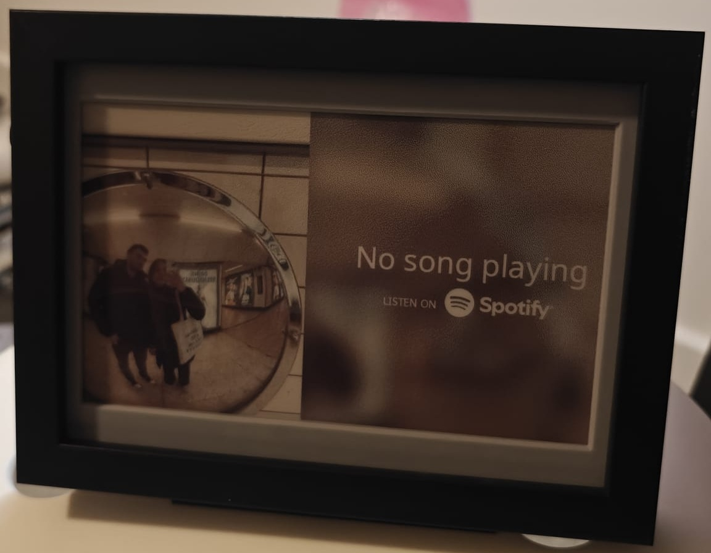
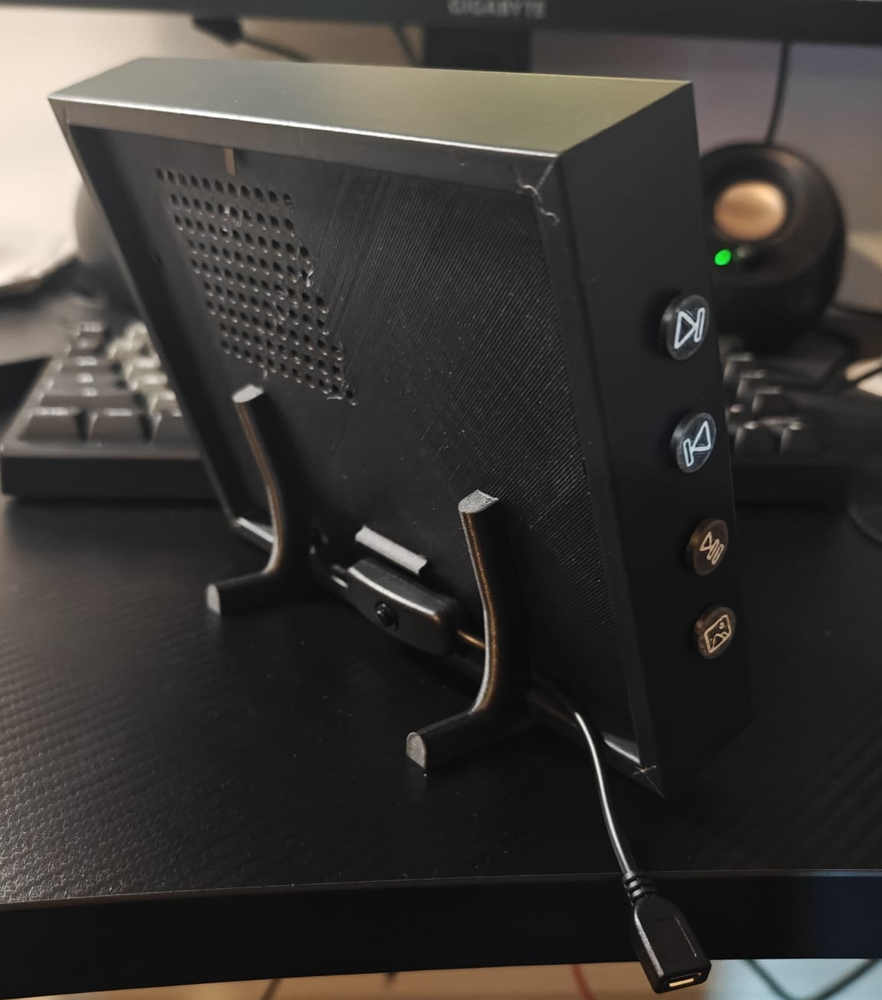
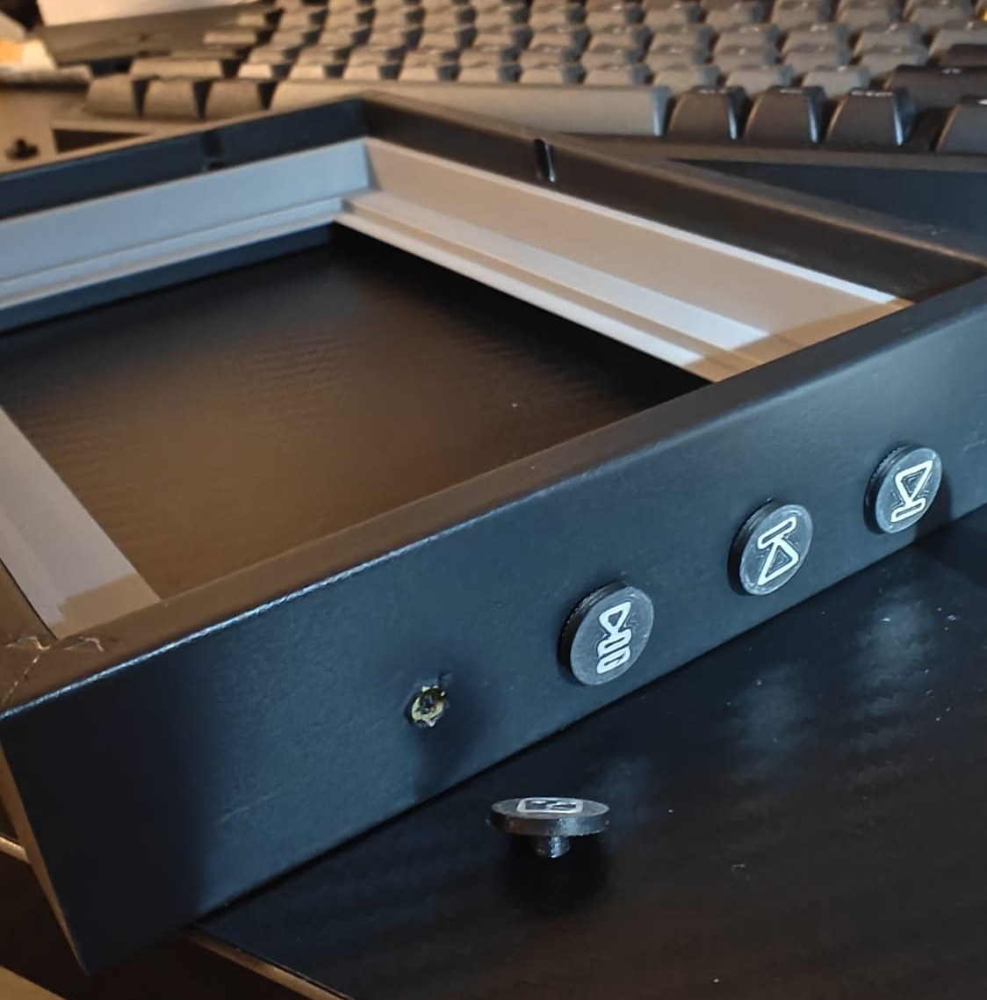

<p float="left">
  
  
</p>

# Spotipi E-Ink (Gift version)  
**Headless Raspberry Pi Spotify display customised as a gift**

Using a Pimoroni Inky Impression 7.3″ display to show your Spotify “Now Playing” info, with a fallback hotspot for headless Wi-Fi setup.

---

## Background & Origin  
Forked from [Gabbajoe’s spotipi-eink](https://github.com/Gabbajoe/spotipi-eink) and rebuilt as a gift with:  
- A headless Wi-Fi fallback captive portal (SSID **Spotipi Setup**)  
- Custom “Now Playing” visuals inspired by Amresh Sinha’s Spotify-Cards API  
- Randomized idle-mode images (one change per idle session)  
- Remapped buttons, Unicode-friendly font, and 3D-printed mounts  

---

## Features & Changes  
- **Wi-Fi fallback portal**: if no upstream connectivity, creates a hotspot named **Spotipi Setup** (see [wifi-connect-setup](https://github.com/kokossas/wifi-connect-setup))  
- **Now-playing card**: track/artist/album art in a style based on Amresh Sinha’s design  
- **Idle mode**: shows a random image from `~/spotipi-eink/images/idle` (one cycle per idle session via Button D)  
- **Button mapping**:  
  - **A** → Next track  
  - **B** → Previous track  
  - **C** → Play/Pause  
  - **D** → Cycle idle image  
- **Unicode-friendly font** for non-English characters  
- **3D-printed mounting**, buttons & the modified frame from IKEA ([RÖDALM](https://www.ikea.com/us/en/p/roedalm-frame-black-10548867/)) (Designs in [CAD](CAD/))  

<p float="left">
  
  
  
</p>
---

## Spotify Developer Account  
You’ll need to supply your Spotify API credentials. If you’re gifting this, have the recipient:  
1. Sign up at https://developer.spotify.com/dashboard  
2. Register a new app  
3. Copy the **Client ID**, **Client Secret**, and set a **Redirect URI** (e.g. `https://localhost.com/callback`)
4. Give you those values before running `setup.sh`

---

## Installation  

```bash
wget https://raw.githubusercontent.com/kokossas/spotipi-eink/main/setup.sh
chmod +x setup.sh
bash setup.sh
```

When it finishes, reboot:

```bash
sudo reboot
```

For full details on:
- Wi-Fi fallback portal, see https://github.com/kokossas/wifi-connect-setup.
- Spotipi-eink, see https://github.com/Gabbajoe/spotipi-eink
---

## Usage  
- **On boot**:  
  - Online & playing → shows “Now Playing”  
  - Online & idle (no playback) → displays a random idle image and a "No song playing" text 
  - Offline → Display will refresh to blank until you configure Wi-Fi via the hotspot
- **Buttons**:  
  - **A**: Next track  
  - **B**: Previous track  
  - **C**: Play/Pause  
  - **D**: Show a new random idle image  

---

## Transferring Your Own Idle Images  
Copy images (PNG, JPEG, etc.) into `~/spotipi-eink/images/idle`. For example:

```bash
scp "/path/to/example.png" "pi@<raspberry-pi-ip>:~/spotipi-eink/images/idle"
```

---

## Credits & Inspiration  
- **Original Project**: Gabbajoe’s [spotipi-eink](https://github.com/Gabbajoe/spotipi-eink)  
- **Now-playing visuals**: Amresh Sinha’s [Spotify-Cards-API](https://github.com/AmreshSinha/Spotify-Cards-API)  
- **Frame inspiration**: AKZ Dev’s IKEA-frame build from his [YouTube Video](https://www.youtube.com/watch?v=L5PvQj1vfC4)
- **3D-printed mounts**: [Design](https://makerworld.com/en/models/1221196-ikea-rodlam-inky-impression-7-mount#profileId-1238116) from MakerWorld, modified to fit IKEA frame  
- **Display hardware**: Pimoroni Inky Impression 7.3″  
